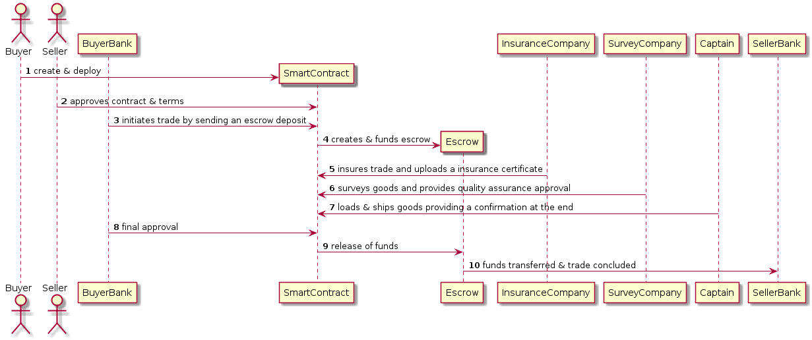

## Architecture



### DashBoard functionalities

1. `Buyer` - Create and deploy contracts
2. `Seller` - Approve contracts created by buyers
3. `BuyerBank` - View contract terms+funds and submit deposit for a trade contract
4. `Insurance Company` - View contract terms, upload an insurance certificate to IPFS, provide certificate reference for the smart contract
5. `Survey Company` - view contract terms, provide quality assurance approval for the smart contract
6. `Captain` - view contract terms, provide a logistical ref number for the smart contract
7. `SellerBank` - view contract terms and funds

#### Contract terms

1. Trade Object 

```
{
	commodity,
	price,
	deliveryDate,
	deliveryVehicle,
	deliveryTerm,
	quantity,
	tolerance,
	surveyCompany,
	insuranceCertificate,
	commodityInfo
	status;
}
```

Note - status is an enum value {Initialized, Approved, Active, Fulfilled, Concluded}

2. Addresses for 7 participants => `buyer`, `buyerBank`, `seller`, `sellerBank`, `InsuranceCompany`, `SurveyCompany`, `Captain` and the temporary `Escrow`.

3. `Description` - a brief trade description

4. Eth Balances for any/all addresses including te 7 participants but especially for `buyerBank`, `sellerBank`, `Escrow`.

5. TO-DO - All approvals/ref numbers uploaded by various parties

#### TO-DO: All parties should be able to see various documents uploaded by various parties during a trade. This screen will be common to all parties and these documents stored onto a common place/db (TO-DO - migrate to IPFS storage)

